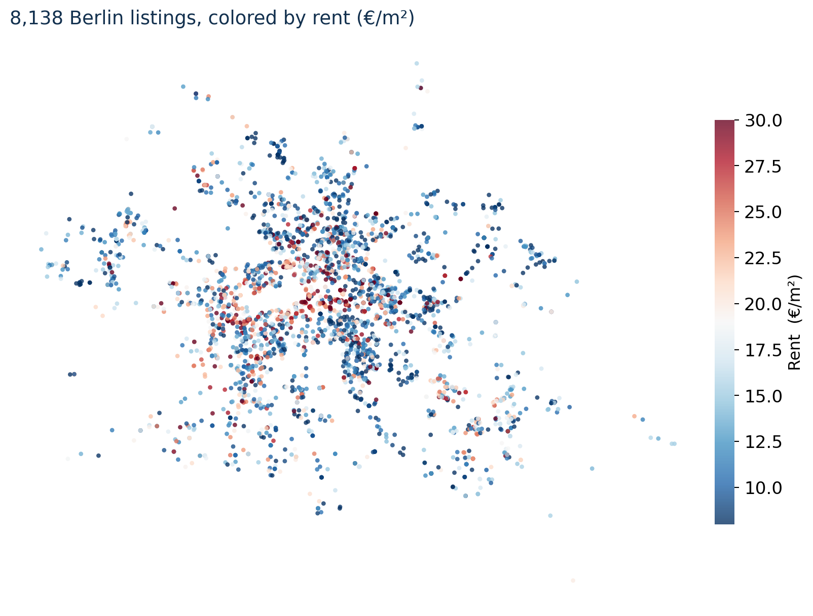
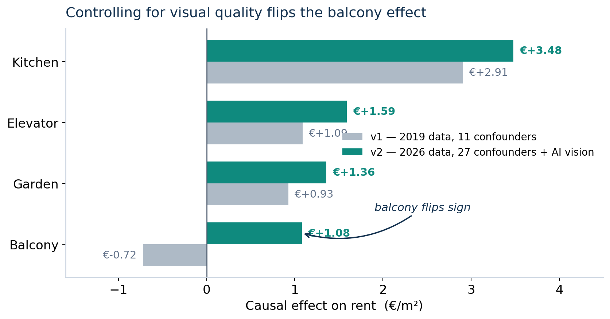
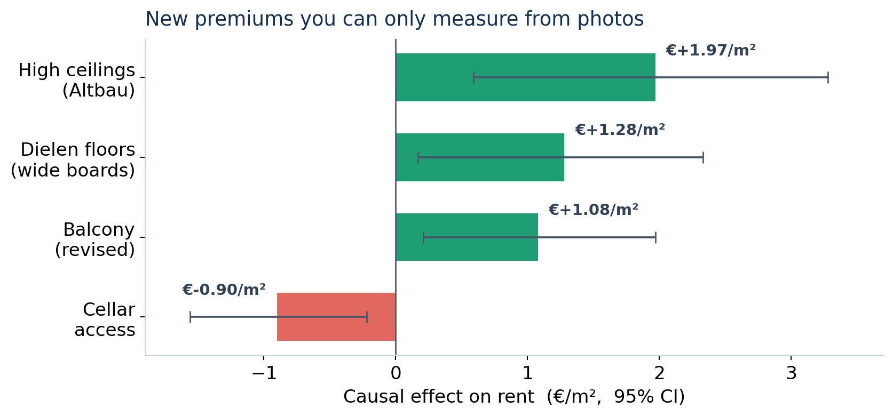

> Part of [**RentSignal**](https://rentsignal.de) — an AI rent-optimization engine for the German rental market.

Here is a number that should bother you. In Berlin's rental listings, apartments *with* a balcony rent for slightly **less** per square meter than apartments *without* one. Read literally, that advises a landlord to tear the balcony off and charge more. Obviously, nobody believes that. So what is a balcony actually worth — and why does the raw data insist on lying to us?

The answer is a small masterclass in why **correlation isn't causation**, and a demonstration that the fix sometimes requires data we simply couldn't measure until very recently: satellite imagery and an AI that reads apartment photos.

## Why the naive number lies: a two-minute primer on confounding

Suppose you want to know the effect of a balcony on rent. The tempting move is to compare the average rent of apartments with balconies to those without. The problem is that **balconies don't get sprinkled onto apartments at random.** They cluster in particular kinds of buildings — and in Berlin, that clustering runs the wrong way for a naive comparison. A great many balconies hang off older, less-renovated *Altbau* stock, or off 1960s blocks in less central locations. So the balcony apartment rents for less not *because* of the balcony, but because of everything the balcony quietly travels with: an older, shabbier, cheaper building.

That lurking third factor — building quality — is a **confounder**: it influences both whether an apartment has a balcony *and* what it rents for, creating a fake correlation between them. The balcony takes the blame for its company.

What we actually want is the effect of *adding a balcony while holding everything else fixed* — the **average treatment effect on the treated** (ATT):

$$
\text{ATT} = \mathbb{E}\big[\,Y(1) - Y(0)\,\big|\, T = 1\,\big],
$$

the difference between an apartment's rent *with* the feature and what that very same apartment would have rented for *without* it. We never observe both worlds for one apartment, so the whole game is constructing a credible stand-in for the missing one — by comparing apartments that are alike on every confounder we can measure. The estimate is therefore only as honest as that confounder list. Miss building quality and the balcony stays framed.

## The data

I worked from a March 2026 scrape of ImmoScout24 Berlin — **~8,000 listings**, each geocoded and joined to its rent.

The first modeling decision was what to *throw away*. **41.5%** of the raw listings were *Tauschwohnungen* — apartment swaps offered at deliberately below-market rent (median €10.37/m² versus €19.00/m² for regular listings). Their price is set by rent control and swap dynamics, not amenities, so leaving them in would poison every estimate. Out they went, leaving **~4,800 regular listings**.

## The design: matching, with confounders you couldn't see before

The tool is **propensity-score matching**: for each apartment with a balcony, find an apartment *without* one that looks just like it across the confounders, compare their rents, and average those gaps. Simple in spirit; the magic is entirely in how rich the "looks just like it" can be made.

This model matches on **27 confounders**, including two whole categories that a hedonic regression from a decade ago simply could not see:

- **Structural** — size, rooms, building era, floor, condition.
- **Spatial** — distance to the centre, to the U-Bahn, parks and water; counts of food/cafés/shops within 500–1000 m; and **Sentinel-2 satellite indices** for vegetation, water, and built-up density.
- **Visual, read from the listing photos by an AI** — `renovation_level`, `interior_quality`, `brightness`, and `building_condition`, extracted by a Gemini vision model.

That last group is the key that unlocks the paradox. A balcony correlates with older, less-renovated buildings — so unless you can actually *measure* renovation and interior quality, you can't peel the balcony's effect apart from the building's. AI-extracted image features finally let you hold "how nice and renovated does this place look" constant while you vary the balcony alone.

## The paradox, resolved

With the full confounder set, balance is excellent (all 30 covariates have a standardized mean difference below 0.1 on the matched balcony sample), and the balcony's effect **flips sign**:

The earlier version of this analysis (older data, no image or spatial controls) faithfully reproduced the paradox: a *negative* balcony effect of −€0.72/m². Adding the renovation and interior-quality confounders does exactly what the theory promises. Once you stop letting "old and shabby" hide inside "has a balcony," the balcony's true premium surfaces: **+€1.08/m²**, with a 95% confidence interval (€0.21–€1.97) comfortably above zero. For a 75 m² apartment that's about **+€80/month** that the naive number was throwing in the bin.

Kitchen comes out as the single largest fitted premium at **+€3.48/m²**, and it's heterogeneous across building eras — strongest in older and mid-century stock, near zero in post-2015 new-builds where a modern kitchen is simply assumed.

## New premiums you couldn't measure before

Here's the part I find most fun. Because the confounders come from photos, the *treatments* can too. Beyond the classic four amenities, I estimated causal effects for features that only a vision model can reliably tag across thousands of listings:

**High ceilings (+€1.97/m²)** and **original Dielen plank floors (+€1.28/m²)** — the signatures of desirable Berlin *Altbau* — carry real, identifiable premiums once you can *see* them at scale. The cellar's negative sign is almost certainly residual confounding with older peripheral buildings (a healthy reminder that not every coefficient is a clean causal effect). As far as I can tell, using AI-extracted image features as the *treatment* in a hedonic matching design is genuinely novel: the photos become both the controls *and* the variables of interest.

## Why it matters

Two takeaways, one for the method and one for the money.

**For the method:** the balcony paradox is a clean, visceral demonstration that *better confounders change conclusions* — not by a rounding error, but by flipping a sign. Multimodal data (satellite + vision) isn't a garnish here; it's the thing that makes the un-confounding possible at all. The missing variable was always "how renovated is this apartment," and for the first time it's measurable across an entire market.

**For the money:** to a rent-optimization product, the gap between "balconies cost you money" and "a balcony adds ~€80/month" is the gap between bad advice and good advice. When the output is a recommendation a landlord will act on, you want *causal* estimates — not raw correlations, and not even a black-box model's feature importances.

The naive number wasn't wrong because the data was dirty. It was wrong because a balcony rarely travels alone.
