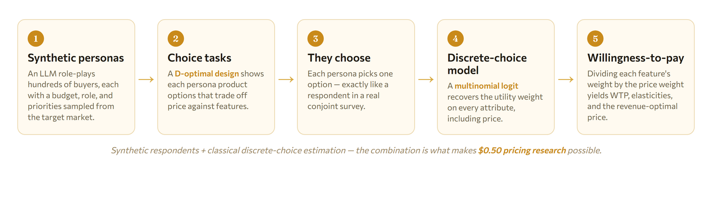
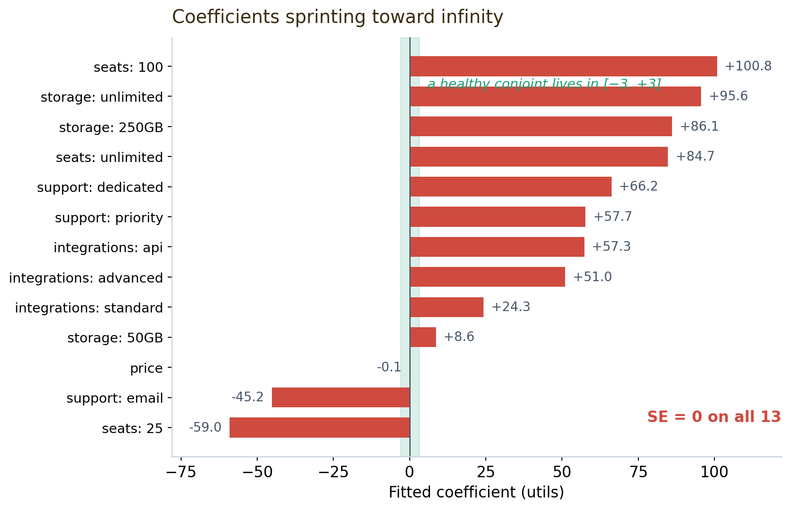

> Part of [**BeeSignal**](https://beesignal.ai) — a pricing-research engine that runs experiments on LLM-generated synthetic consumers.

A model that fits *too* well is not good news. It is a symptom. This is the story of a result so good it had to be wrong — and of what went wrong, which turned out to be a problem you can only have when your survey respondents are made of language instead of flesh.

But to see why it's interesting, you first need to know what I was even trying to do.

## First: what is a "synthetic consumer," and why simulate one?

Companies spend a fortune answering one deceptively simple question: *what will people pay, and for which features?* The gold-standard method is **conjoint analysis** — a type of survey where, instead of asking "how much would you pay for feature X?" (people are terrible at answering that), you show respondents a series of product cards with different feature/price combinations and simply watch **which ones they pick**. From hundreds of those choices, a statistical model backs out how much each feature is secretly worth. It's the same math behind how airlines price seats and how SaaS companies design their pricing tiers.

The catch: a real conjoint study means recruiting hundreds of qualified respondents, and it costs \$50,000–\$200,000 and takes months. So here's the bet behind [BeeSignal](https://beesignal.ai): what if you replace the humans with an **LLM role-playing each respondent**? You give a language model a detailed persona — "you are a sales manager at a 50-person company, budget \$500–2,000/month, you care about X and Y" — show it the same product cards, and record its choices. Do that a few hundred times and you have a synthetic survey for about **\$0.50** instead of \$50,000.

The whole pipeline looks like this:



Two pieces deserve emphasis, because their combination is what's genuinely new:

- **The estimation is real econometrics, not vibes.** Step 4 is a *discrete-choice model* — specifically a **multinomial logit (MNL)**, the workhorse that earned McFadden a Nobel Prize. By randomizing which features appear on which card (a "D-optimal design"), the survey *experimentally identifies* the causal weight each attribute carries in a decision. It's a randomized experiment, just run inside a survey.
- **The respondents are synthetic.** Bolting a frontier LLM onto the front of a classical discrete-choice pipeline — using simulated people as the experimental subjects — is a recent and still-unusual idea. It's powerful precisely because it's cheap enough to run dozens of times. But it also introduces failure modes that a textbook on conjoint analysis has never had to warn you about. This post is about one of them.

## The result that set off the alarm

I ran a conjoint study for a fictional B2B SaaS product (call it *Planwise*): 50 synthetic respondents, 16 choice tasks each, a clean MNL at the end. The estimation came back looking spectacular:

| Signal | Value | What it should be |
|---|---|---|
| Pseudo-R² | **0.911** | ~0.2–0.4 for real conjoint |
| Standard errors | **0.000 on all 13 coefficients** | strictly positive |
| Willingness-to-pay | **up to \$1,683 / seat** | tens of dollars |

To anyone who has fit one of these models, this table is alarming, not impressive. A pseudo-R² of 0.911 on choice data is the statistical equivalent of a fire alarm. And standard errors of *exactly* zero are impossible in a healthy model — they mean the optimizer never actually found an answer. Something had silently broken, and the rest of this post is the autopsy.

## The suspect: perfect separation

The hypothesis I started with was **perfect separation** — a classic pathology of logit models. Separation happens when the data is so clean that some combination of the features predicts every single choice *without error*. When that happens, the model's log-likelihood keeps rising as the coefficients march off toward $\pm\infty$; there's no finite peak to climb to. The optimizer gives up at some large arbitrary value, and the curvature of the likelihood surface there — the Hessian — has flattened to nothing. Since the standard errors are computed by inverting that curvature,

$$
\widehat{\mathrm{SE}}(\hat\beta) = \sqrt{\operatorname{diag}\big(\,[-H(\hat\beta)]^{-1}\big)},
$$

a flattened (singular) Hessian yields standard errors that are numerically zero and coefficients that are meaningless.

The deeper question is *why a synthetic study would separate when a human one wouldn't.* My bet: **temperature** — the LLM's randomness dial. I had run it at `temperature=0.7`, low enough that each persona behaved almost deterministically, always picking the "obviously better" option and never wavering. Real humans are noisy, and that noise is exactly what keeps the math well-behaved. Strip it out and the data becomes too perfect to estimate from. Let's prove it, in three layers.

## Layer 1 — what did the LLM actually do?

Across 800 choices, the headline split looked unremarkable: 53.4% picked option A, 44.5% picked B, 2.1% chose neither. But two things stood out:

- **Confidence was pinned to the ceiling.** Mean self-reported confidence was 0.90 (75th percentile: 0.95). The personas were almost never unsure.
- **Counterbalancing agreement was 86.6%.** Each task was shown twice with the options swapped, to catch position bias. Re-ask a *noisy* respondent a flipped question and they'll disagree with themselves a fair fraction of the time. Agreeing with itself 86.6% of the time — at a temperature meant to inject randomness — is the first fingerprint of over-determinism.

Suggestive, but not yet damning. For the smoking gun, I had to look at consistency.

## Layer 2 — the smoking gun

Here's the subtle part. A conditional logit conditions on each respondent individually — it explains the choices *within* a person. So separation is a **within-respondent** property. The right question isn't "do all respondents agree with each other?" (they shouldn't, and didn't) but "is each individual respondent perfectly rationalizable by one fixed set of preferences?"

Two measurements answered it:

- **Price monotonicity: 100%.** In all 650 tasks where one option was strictly cheaper, the cheaper one was chosen. Not 70%, not 85% — *every single time.*
- **Per-respondent consistency: 100%, for all 50 respondents.** Each persona's sixteen choices were perfectly explained by one deterministic ranking, with zero internal contradictions.

That is precisely the data-generating process that breaks maximum likelihood: fifty individually-perfect, contradiction-free respondents. Pool fifty perfectly-separable panels and the likelihood has no finite peak. (Tellingly, the *pooled* per-attribute agreement was only ~55% — proof the personas had genuinely different tastes. They weren't clones all picking the same thing; each was just internally, mechanically deterministic.)

## Layer 3 — the geometry of the failure

The estimation layer confirmed it cold. The Hessian at the reported "optimum" was numerically singular:

| Diagnostic | Value | Reading |
|---|---|---|
| Condition number | **2.94 × 10²⁰** | ≫ 10¹² → singular |
| Rank deficiency | **8 of 13 eigenvalues ≈ 0** | likelihood is flat in 8 directions |
| Min eigenvalue | ≈ 0 (not > 0) | not a true maximum |

And the coefficients themselves gave the whole game away. A healthy conjoint has feature utilities in roughly the $[-3, +3]$ range. Here they had sprinted off the chart:



Coefficients of *one hundred utils* aren't estimates; they're the optimizer running toward infinity until an iteration limit cut it off. The near-zero price coefficient (−0.06) is what then detonates the WTP numbers, since willingness-to-pay is $-\beta_\text{attr}/\beta_\text{price}$: divide a 100-util feature effect by a price coefficient of −0.06 and you get the absurd \$1,683.

The causal chain, end to end:

```
temperature = 0.7
  → personas near-deterministic (always pick the "obviously better" option)
  → every respondent's choices are perfectly separable on their own
  → conditional log-likelihood has no finite maximum (β → ∞)
  → Hessian → singular at the cutoff point
  → standard errors = 0
  → β_price → 0, feature β → 100  ⟹  WTP explodes
```

## The fix

The diagnosis dictated the cure. The problem was never the model or the pipeline — it was that the respondents had no noise. So you add it back, in calibrated amounts:

| Fix | Change | Why |
|---|---|---|
| **Raise temperature** | `0.7 → 1.1` | restores realistic ~75–85% consistency, breaking the separation |
| **More respondents** | `N = 50 → 100` | satisfies the standard conjoint sample-size rule, shrinks SEs honestly |
| **L2 regularization** | `λ = 0.1` on the MNL | a guaranteed backstop: a ridge penalty makes the Hessian invertible even if some separation survives |

Temperature is the lever that matters most; the ridge penalty is the seatbelt that bounds the coefficients and restores a finite, invertible Hessian no matter what.

## The real lesson

The honest reason this case is worth writing up: the failure is *specific to synthetic data*, and it's invisible if you only look at the summary stats. With human respondents you essentially never see perfect separation, because people are gloriously inconsistent. Swap in an LLM at low temperature and you manufacture respondents who are too rational to estimate from — and the model thanks you with a pseudo-R² of 0.911 that looks like a triumph instead of an alarm.

The lesson generalizes far beyond pricing: **when you generate your own respondents, the noise is a modeling choice, not a nuisance to be minimized.** A synthetic-data platform needs a diagnostic gate — separation checks, Hessian condition numbers, sane coefficient bounds — standing between "the run finished" and "the result is trustworthy." A number that's too good to be true usually is, and the most useful thing a model can do is tell you exactly *how* it broke.
