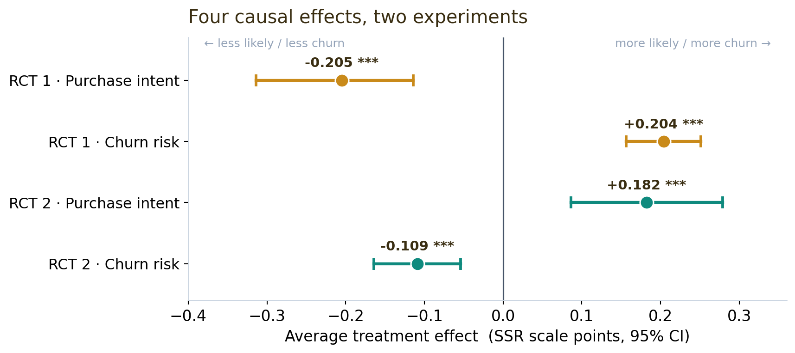
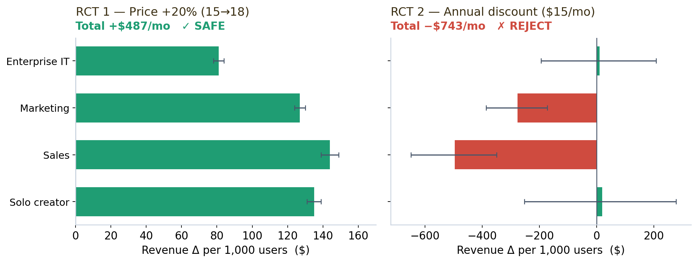

> Part of [**BeeSignal**](https://beesignal.ai) — a pricing-research engine that runs experiments on LLM-generated synthetic consumers.

Every SaaS team has the same two arguments on repeat. *Can we raise the price without bleeding users?* And *should we push everyone toward annual billing?* The usual answers are a confident PM's gut, a competitor screenshot, or — if you're disciplined — a live experiment that puts real revenue at risk for a month.

Here I take a real product (Loom, the async-video tool) and answer both questions with two **randomized controlled trials run entirely on simulated buyers** — for about the price of a coffee. The fun part isn't just the recommendations; it's that the synthetic respondents reproduce *known human behavior*, which is what makes the method worth trusting at all.

## What is a "synthetic RCT," exactly?

Two ideas combine here, and both deserve a plain-English version.

**Synthetic respondents.** Instead of recruiting humans, [BeeSignal](https://beesignal.ai) has a large language model *role-play* each buyer. You hand the model a detailed persona — "you're a sales manager at a 50-person company, budget \$500–2,000/month for tools, you care about tracking whether prospects watch your videos" — and it answers as that person. Hundreds of personas, sampled to match a real target market, become a synthetic respondent pool for cents instead of tens of thousands of dollars. (Getting these personas to behave *realistically* is its own challenge — [a previous post](../synthetic-consumers-perfect-separation/synthetic-consumers-perfect-separation.qmd) is a post-mortem of what happens when they behave *too* perfectly.)

**A vignette RCT.** A randomized controlled trial is the cleanest way to establish cause and effect: split your subjects at random into two groups, change exactly one thing for one group, and compare. It's the A/B test, formalized. A *vignette* RCT does this with a short written scenario — each respondent reads one version ("Loom Business is **\$15/mo**" vs "Loom Business is **\$18/mo**") and reacts. Because the two groups are otherwise identical *by construction*, any difference in their reactions is **caused** by the price change. Nothing to confound.

Put them together and you get something genuinely new: **causal experiments on a simulated population.** You can A/B test a pricing decision *before* it touches a single real customer — and rerun it as many times as you like.

## The design (shared by both trials)

Both studies are between-subjects vignette RCTs:

- **200 personas per study**, sampled across four buyer segments — solo creators, sales teams, marketing teams, and enterprise IT — each with their own budgets, priorities, and pain points.
- **Random assignment to one arm**, stratified by segment so the arms stay balanced ($\chi^2$ balance check: $p = 0.998$).
- Each persona, played by a frontier LLM at **temperature 1.0**, reads *one* vignette and reports three outcomes: purchase intent, churn risk, and max willingness-to-pay, each on a 1–5 scale via *semantic similarity rating* (which maps the free-text answer onto a distribution over the scale rather than forcing a single number).
- Effects are estimated with **OLS and heteroskedasticity-robust (HC1/HC3) standard errors**, bootstrap confidence intervals, and a **causal forest** for heterogeneous effects by segment.

### First, did randomization work?

The entire causal claim rests on one thing: the two arms have to be comparable *before* the treatment, so that any difference *after* it is caused by the treatment alone. Randomization is supposed to guarantee that, but with a finite sample you check rather than assume. Both studies used **segment-stratified** assignment — randomizing *within* each buyer segment — which forces the arm sizes and the segment mix to line up:

| Balance check | Result |
|---|---|
| Arm sizes (control / treatment) | 99 / 101 |
| Segment composition across arms | $\chi^2$ test, *p* = 0.998 — indistinguishable |
| Pre-analysis diagnostics | 0 high-severity, 0 medium-severity flags |

A $\chi^2$ *p*-value of 0.998 means the segment makeup of the two arms is statistically identical — exactly what you want (here a *high* p-value is good: it says the groups don't differ). With the arms confirmed balanced, the comparison is clean.

Because assignment is randomized, the average treatment effect is then identified by a plain difference in arm means:

$$
\text{ATE} = \mathbb{E}[Y \mid \text{treatment}] - \mathbb{E}[Y \mid \text{control}].
$$

All four headline effects — two per study — come out clean and significant:

## RCT 1 — Can Loom raise its price 20%?

**The treatment:** Business tier from **\$15/mo → \$18/mo** (a 20% increase). Control sees \$15, treatment sees \$18, nothing else changes.

The demand response is exactly what economics predicts — and precisely estimated. Purchase intent drops (−0.205, *p* < 0.001, a moderate-to-large effect of Cohen's *d* = −0.56) and churn risk rises (+0.204). Buyers like the higher price less and are likelier to leave. No surprise there. The **real** question is whether the extra 20% you charge the survivors outweighs the ones you lose.

So I translate intent into money. The break-even churn for a 20% increase is

$$
\text{break-even churn} = 1 - \frac{15}{18} = 16.7\%,
$$

map the churn scores to churn probabilities through a calibrated curve, and propagate the causal-forest confidence intervals all the way to revenue, segment by segment:

| Segment | Weight | Revenue Δ (per 1,000 users) | 95% CI | Verdict |
|---|---|---|---|---|
| enterprise_it | 15% | +\$81 | [+78, +84] | SAFE |
| marketing_team | 20% | +\$127 | [+124, +130] | SAFE |
| sales_team | 30% | +\$144 | [+139, +149] | SAFE |
| solo_creator | 35% | +\$135 | [+131, +139] | SAFE |
| **Total** | | **+\$487/mo (+5.4%)** | [+472, +501] | **SAFE** |

**The verdict: raise it.** Even after losing ~74 of every 1,000 users, the flat \$18 price is revenue-positive in *every* segment, with a confidence interval that never crosses zero. The heterogeneity is sensible too — solo creators are the most price-sensitive (−7.6% intent), sales teams the least (−3.0%), because the tool is mission-critical to the latter.

## RCT 2 — Should Loom push annual billing?

**The treatment:** the *same product*, framed two ways — **\$18/mo month-to-month** (control) vs **\$180/yr = \$15/mo effective** with a 12-month commitment (treatment). Same dollars on the table; only the billing frame and the \$3/mo "annual discount" change.

Here the synthetic buyers reveal a genuine *behavioral* effect: annual framing makes them **more likely to commit** (purchase intent +0.182, *p* < 0.001) and **less likely to churn** (−0.109) — the commitment-and-discount pattern that behavioral economics documents in real humans, reproduced here without a single real respondent. The segment split is striking: **enterprise IT (+11.7%)** and **solo creators (+9.0%)** love the annual deal, while sales and marketing teams barely react (+0.6%, +1.0%) — they were already going to buy.

And that heterogeneity is the whole story, because the revenue math delivers a twist — best seen side by side with RCT 1:

Despite *higher* conversion and *lower* churn, the annual discount **destroys −\$743/mo** per 1,000 users. Why? Sales and marketing teams already convert at ~89% on monthly — handing them a 20% discount is pure giveaway. The right move is **monthly \$18 as the default, annual as an opt-in** that self-selects commitment-oriented buyers, with the \$3/mo gap reframed not as a discount but as a **20% lock-in premium** people pay for month-to-month flexibility. If you test the annual nudge anywhere, test it on enterprise IT and solo creators — the only two segments whose interval even touches positive.

## Why these two belong together

Run alone, each trial is a tidy result. Run together, they make a sharper point: **identical methodology, opposite recommendations.** A 20% price hike — which *feels* aggressive — is safe and revenue-positive. An annual discount — which *feels* generous and customer-friendly — destroys margin everywhere except two segments. Intuition gets both backwards; the randomized design and the revenue translation get both right.

And the credibility comes from the *behavior*, not the prose. The synthetic buyers show **downward-sloping demand** in RCT 1 and **commitment-framing effects** in RCT 2 — two well-established human patterns — with effect sizes large enough to estimate cleanly and segment heterogeneity that matches business intuition. That's the bar a synthetic-respondent method has to clear before anyone should trust it: not "did it produce a number," but "did it reproduce a known effect."

## Honest limitations

These are simulated consumers, not humans, and I'd treat the output as **directional decision support, not ground truth**. The revenue layer leans on a calibrated mapping from intent scores to churn/conversion probabilities, which is itself an assumption. Willingness-to-pay even behaves oddly in RCT 2 — the annual arm *states* a lower max WTP while it *converts* better, a reminder that stated WTP and revealed choice diverge in synthetic respondents as in real ones. What synthetic RCTs buy you is **speed and safety**: you can pre-screen a dozen pricing ideas for a few dollars, kill the obviously bad ones, and walk into a real experiment already knowing which lever to pull — instead of spending a quarter and real customer goodwill to discover the annual discount was a mistake.
